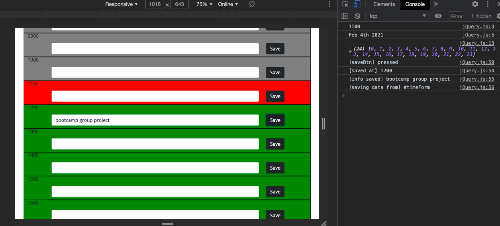

# Homework5

**Deployed application URL**
https://talkingskunk.github.io/homework5-dayPlanner/

**GitHub Repository URL**
https://github.com/TalkingSkunk/homework5-dayPlanner

## Table of Contents

* [Description](#description)
* [Installation](#installation)
* [Usage](#usage)
* [Credits](#credits)
* [License](#license)
* [Badges](#badges)
* [Features](#features)
* [Contributing](#contributing)
* [Tests](#tests)

## Description 

**What was the problem?**
- I needed to create a day planner.

**What would be the foreseeable consequences of the problem?**
- A war with the computer langauges.

**What were your goals?**
- To create a working day planner.

**What have you done about it?**
- Create color coded day planner.
    - If it is past, the hour is grey.
    - If it is present, the hour is red.
    - If it is future, the hour is green.
- Create a present date.
- Create a localStorage for each hour, with working Save button.
- Create a responsive design.

## Installation

All you need is a working computer or a smartphone, and access to Internet!

## Usage 

Click the red button. And follow the prompts.

## Credits

@Fil
@Luca B

**Tutorials**

* https://www.w3schools.com/
* https://stackoverflow.com/questions/3746725/how-to-create-an-array-containing-1-n
* https://stackoverflow.com/questions/8043026/how-to-format-numbers-by-prepending-0-to-single-digit-numbers

## License

MIT License

Copyright (c) [2021] [Sam Kim]

Permission is hereby granted, free of charge, to any person obtaining a copy
of this software and associated documentation files (the "Software"), to deal
in the Software without restriction, including without limitation the rights
to use, copy, modify, merge, publish, distribute, sublicense, and/or sell
copies of the Software, and to permit persons to whom the Software is
furnished to do so, subject to the following conditions:

The above copyright notice and this permission notice shall be included in all
copies or substantial portions of the Software.

THE SOFTWARE IS PROVIDED "AS IS", WITHOUT WARRANTY OF ANY KIND, EXPRESS OR
IMPLIED, INCLUDING BUT NOT LIMITED TO THE WARRANTIES OF MERCHANTABILITY,
FITNESS FOR A PARTICULAR PURPOSE AND NONINFRINGEMENT. IN NO EVENT SHALL THE
AUTHORS OR COPYRIGHT HOLDERS BE LIABLE FOR ANY CLAIM, DAMAGES OR OTHER
LIABILITY, WHETHER IN AN ACTION OF CONTRACT, TORT OR OTHERWISE, ARISING FROM,
OUT OF OR IN CONNECTION WITH THE SOFTWARE OR THE USE OR OTHER DEALINGS IN THE
SOFTWARE.

## Badges

- 
- 
- 
- 
- 
- 

## Features

- If it is past, the hour is grey.
- If it is present, the hour is red.
- If it is future, the hour is green.
- You see the present date on the top.
- Save your plans in each hour of the day.

## Contributing

[Contributor Covenant](https://www.contributor-covenant.org/version/2/0/code_of_conduct/code_of_conduct.md)

## Tests

Console.log

&copy; 2021 Sam Kim